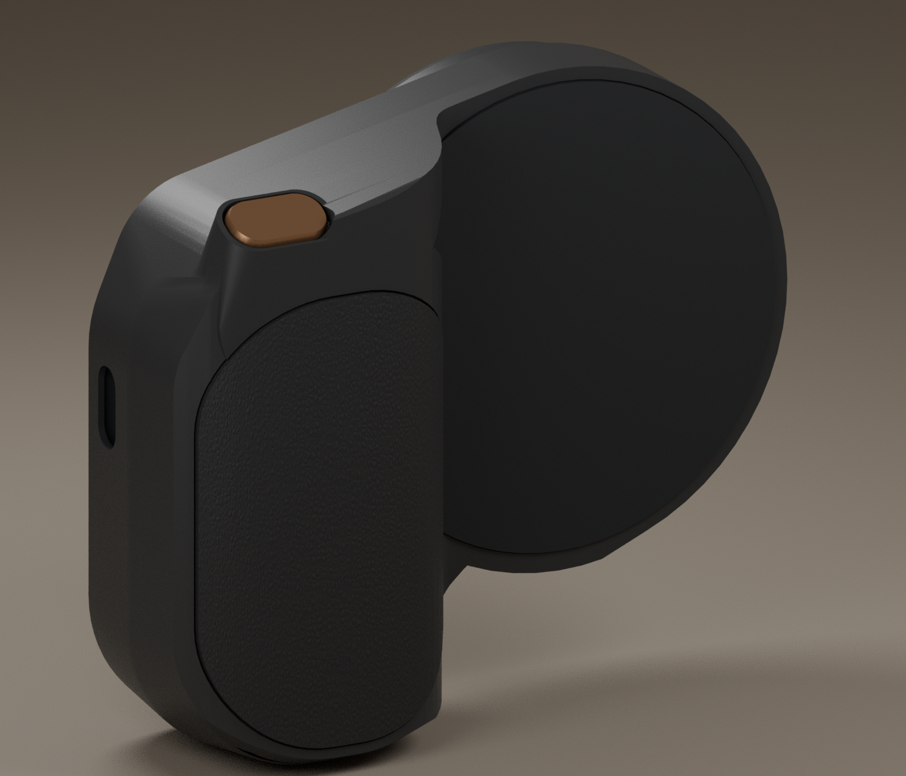

# Magnetic shutter remote — R8 prototype

A rechargeable Bluetooth camera shutter remote for a MagSafe phone grip,
following the JJC MSG-P1 reference product's detachable remote arrangement.
The shutter button is pressed from the **right side** of the PCB. The intended
firmware sends a Bluetooth HID Volume-Up keypress to trigger the phone camera;
a dedicated iOS app is not part of the design. Actual iPhone Camera behavior
still needs testing with assembled hardware.

## Size and hardware

| Item | Current design |
| --- | --- |
| PCB outline | **44 × 56 mm** |
| PCB thickness | **1.0 mm**, FR4 |
| Copper layers | **2: top and bottom** |
| Assembly | 44 fitted component references, 25 exact supplier identities |
| Bluetooth module | DOIT ESPC3-12-N4, ESP32-C3, onboard antenna |
| Shutter | Right-edge, side-actuated TS24CA button |
| Other controls | Power slide switch, pairing button, manual BOOT and RESET |
| Indicators | Red charge-status and Bluetooth-status LEDs |
| Battery | One external protected single-cell Li-ion pack; retained selection ASR00012 |
| Charging | One USB-C port; nominal 300 mA, 4.1 V charge setpoint |
| Programming | Three-pin JST SH, 1 mm pitch, using the standard JST programmer |

The native [3D product assembly](product/README.md) contains the actual PCB,
protected battery envelope, service enclosure, horizontal shutter and detachable
MagSafe grip. The sculpted camera palm and thin circular back follow the latest reference's
**90×78×34mm** target,
excluding unqualified fastener heads/leads.
These are editable prototype dimensions. The PCB remains44×56×1mm.

The enclosure is part of the native tscircuit code: [closed product](product.assembly.tsx)
and [exploded assembly](product.exploded.tsx). Run `bun run dev:product` or
`bun run dev:exploded` to select those views. Editable enclosure plans remain in
[product/geometry.ts](product/geometry.ts); imported models preserve their exact
native triangles and the actual PCB pose. See [assembly instructions](product/README.md).

The first prototype is **shutter-only**. The RGB photo/torch ring and its
connector/power circuit are deferred.

## MagSafe grip and iPhone fit

The target is a common MagSafe grip for multiple supported iPhone sizes and
compatible cases, with a detachable shutter remote. The PCB does not itself
provide a qualified MagSafe mount. The native enclosure/docking geometry is implemented and checked. Exact magnets,
DC shield, cover bonding, camera/case fit, harness/thermal coupling and physical
antenna/retention tests still need qualification.
A smaller PCB does not establish universal iPhone compatibility or a fit inside
the JJC enclosure. See the [mechanical requirements](mechanical/R8-MAGSAFE-REQUIREMENTS.md)
and [reference-product review](mechanical/R8-MAGSAFE-REFERENCE-REVIEW.json).

## Using and programming the remote

Pair the intended Bluetooth HID remote with the phone, open the camera app,
and press the side shutter. Hold the pairing button for three seconds to
request pairing. These are intended firmware behaviors; phone compatibility,
reconnection and shutter response remain physical prototype tests.

USB-C is **charging only**. Charging deliberately disables the radio supply,
so the remote does not operate or program while its USB-C cable is attached.

Use [tscircuit's standard JST programmer](https://tscircuit.com/tscircuit/standard-jst-programmer#3d),
with its UART-capable 0.8.0 firmware, programmer **J5 → remote J3**, and a
straight-through three-pin JST SH cable:

| Remote J3 contact | Signal |
| --- | --- |
| 1 | RX, ESP32-C3 GPIO20 |
| 2 | GND |
| 3 | TX, ESP32-C3 GPIO21 |

Signals use 3.3 V logic; the port has no power contact. Power the remote from
its battery with the power switch ON and remote USB-C unplugged. BOOT/RESET
are manual. Follow the [complete programmer procedure](firmware/programmers/standard-jst-programmer-0.8.0/R8-USAGE.md);
the programmer's RP2040 UF2 is separate from the remote's ESP32 firmware.

## Schematic, BOM and fabrication files

All **44 component explanations** are native schematic text on the same page
as their components. There are only three A4 circuit pages: Power, Radio and
Protection. The separate component-guide pages have been removed.

- [Circuit source](index.circuit.tsx) and [component explanations](src/schematic-component-notes.tsx)
- [Generated Circuit JSON](dist/index/circuit.json)
- [Top PCB view](evidence/R8-inline-notes15-2026-10-07/visual-review/pcb-top.png)
- [JLCPCB BOM](fabrication/R8-inline-notes15-2026-10-07/JLCPCB-BOM.csv) and [placement file](fabrication/R8-inline-notes15-2026-10-07/JLCPCB-CPL.csv)
- [Gerber/drill archive](fabrication/R8-inline-notes15-2026-10-07/R8-inline-notes15-Gerbers.zip)
- [Current review](evidence/R8-reference18-2026-10-07/REVIEW.md) and [publication status](evidence/R8-reference18-2026-10-07/PUBLICATION.md)

## Prototype status

**R8 0.3.18 is a CAD-validated engineering prototype, with hardware untested.**
UI and CLI schematic style analysis report zero issues. Native and independent
checks pass zero DRC errors, shorts, dangling connections and manufacturing/
process failures. Moving the schematic explanations changed no PCB geometry,
components, nets, trace widths or routing from the shutter-only 0.3.12 board.

The 2026-10-07 stock observation covers one board; stock is not reserved.
The radio had three available-to-order units, so five boards require pre-order.
See the [dated stock evidence](evidence/R8-inline-notes15-2026-10-07/sourcing-check.json).
Supplier-processed fabrication/assembly approval and physical programming,
charging, temperature, Bluetooth, RF, runtime and MagSafe tests remain pending.
This is not production or ordering approval.

GitHub source/artifact readback passes. Native0.3.18-prototype is incomplete:
290/291 files, with one PCB model fragment missing afterHTTP502; draft is unready.
Current GitHub/native publication status is recorded in the
[dated receipt](evidence/R8-reference18-2026-10-07/PUBLICATION.md). The previous
0.3.16/17 native uploads remain incomplete because of HTTP413/502 uploads;
new publication is accepted only after actual inventory/readback.
Original issues 075/076 and native warnings 004/084 remain documented.
Missing `3V3` power metadata remains a separate importer issue.

## Development

Read [AGENTS.md](AGENTS.md) and [the current handoff](cloud/HANDOFF.md).
[Cloud setup](cloud/SETUP.md) uses lightweight `bash cloud/setup.sh` and
`bash cloud/smoke.sh`. Heavy engineering jobs must run serially through
`python3 cloud/run-heavy.py` after their qualification gates pass.
Frozen Nordic boards and previous evidence remain immutable. The active electronics
source is four files; original route modules and obsolete mechanics/views are
retained in verified [recovery archives](archive/README.md).
Native closed/exploded entrypoints and optional qualified print-export commands
are documented in [product/README.md](product/README.md).

[Earlier README records, preserved unchanged](evidence/R8-inline-notes15-2026-10-07/README-HISTORY.md).
