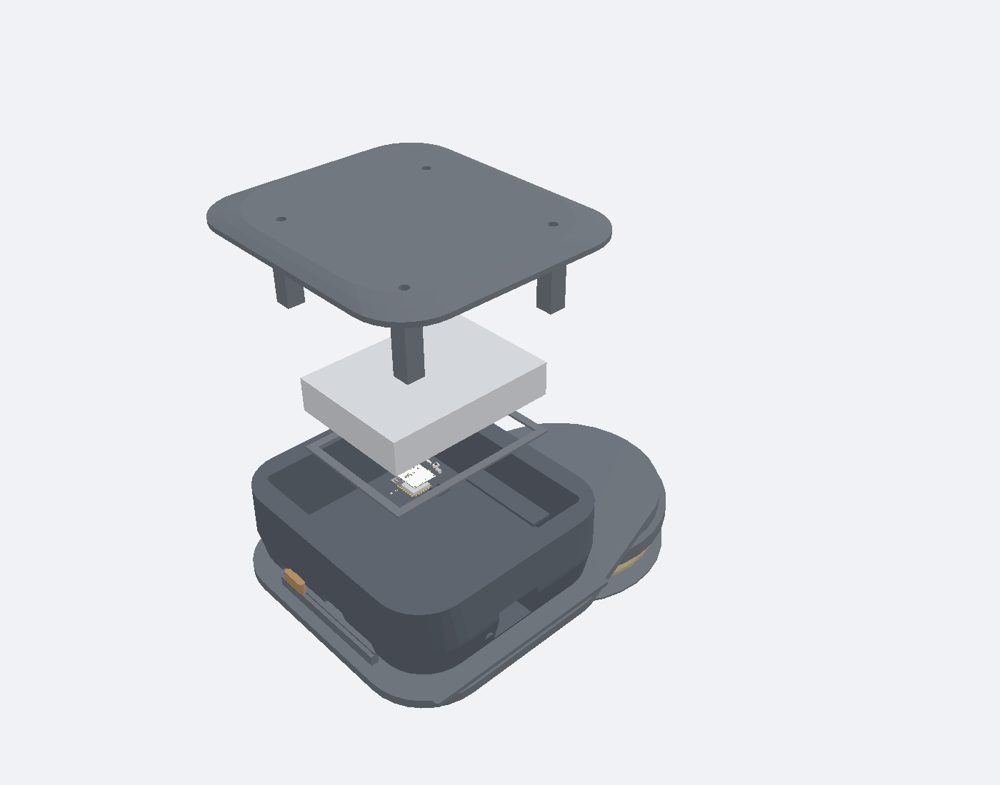
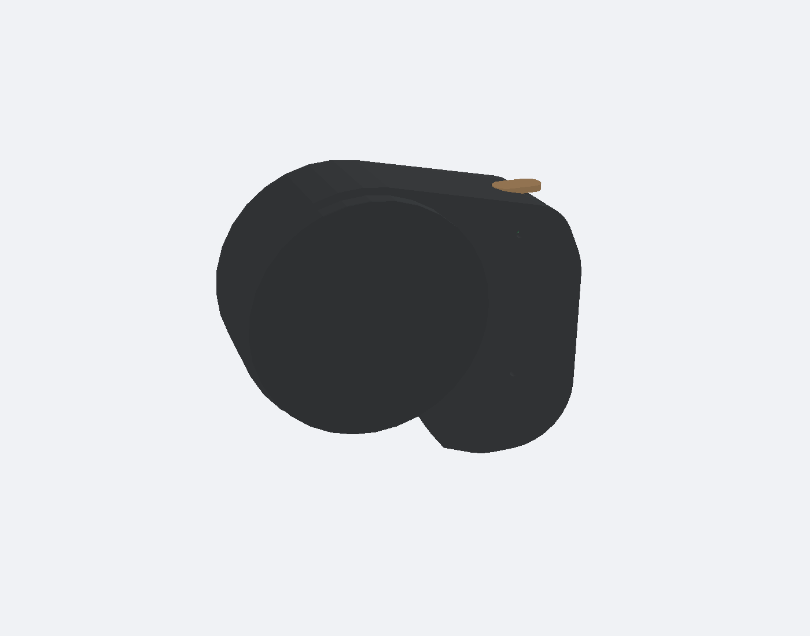
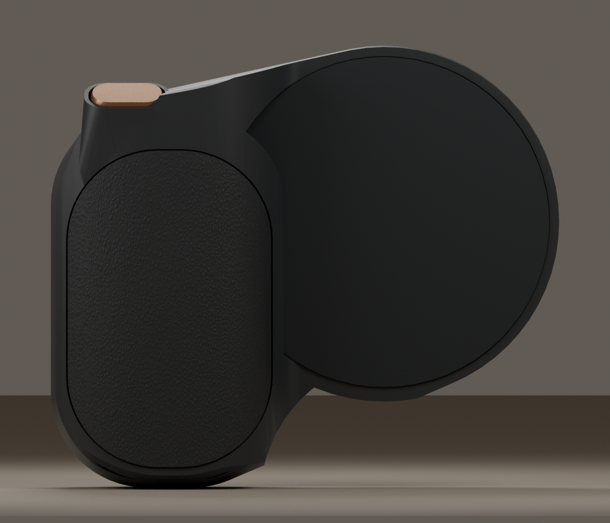
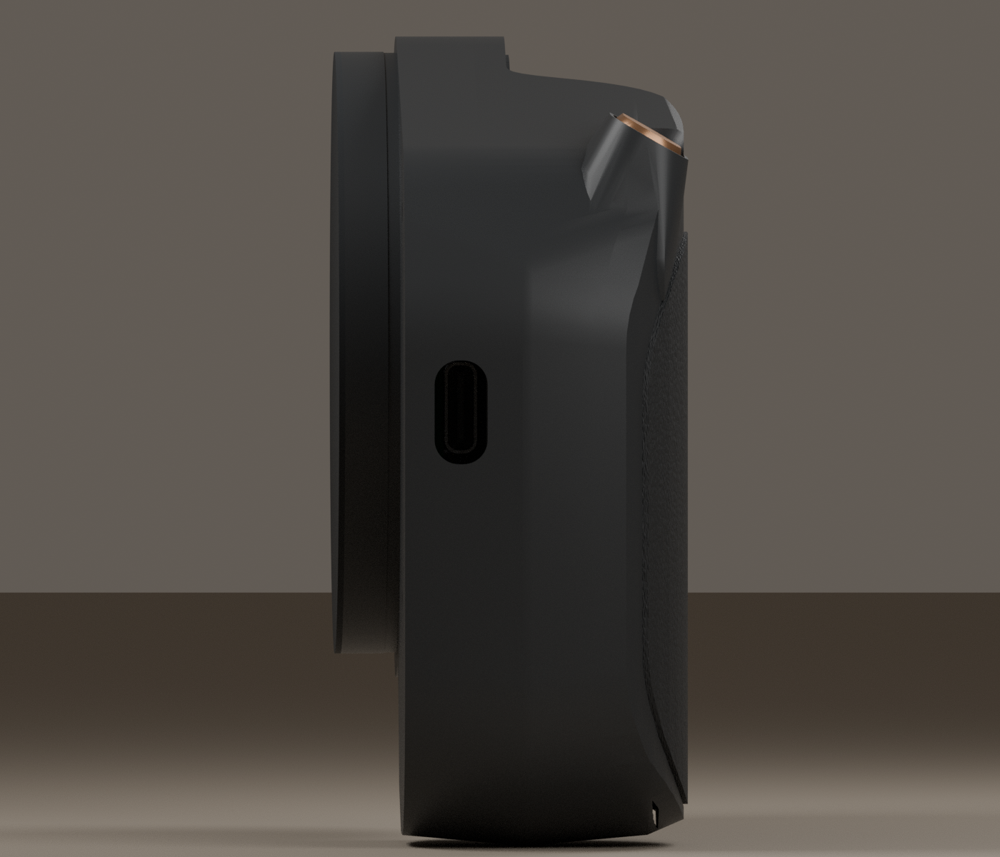

# R8 camera-grip enclosure — 90 × 78 × 34 mm reference prototype





The supplied multi-view image is the design reference: a black sculpted camera
palm flowing into a thin circular back, a bronze pill shutter in the shoulder,
a fine textured lower grip and side USB-C access. The actual fitted CAD now
uses a curved crown, thinner circular body, domed button and continuous shoulder.
The images are studio renders of the native assembly, with material finish and
lighting added. They are not photographs of a manufactured enclosure.

The outer envelope is checked at 90 × 78 × 34 mm. A concept image does not
provide measured surfaces, seam tolerances or a production texture sample, so
exact photographic identity is not verified. Fine leather-like grain is a
specified surface finish shown in the render; fit-print STLs have a smooth
insert for that finish, rather than a drilled dot pattern. No certification
marks from the concept are reproduced.




| Envelope | Checked CAD dimensions, mm |
| --- | --- |
| Whole docked assembly, including shutter cap | 90 × 78 × 34 |
| Unchanged PCB | 44 × 56 × 1 |
| Protected battery maximum envelope | 32 × 43 × 8.5 |
| Phone-facing contact disk | Ø59 |
| Circular back total depth from phone datum | 17.05 |

The unchanged PCB is rotated 90° in plane, centred at product XY(−15.2,−9),
Z9.5, across the upper shoulder and circular body. All traces, four mounting
holes and 44 fitted supplier components retain their original board-relative
positions. The protected ASR00012 pack occupies the lower palm. Dimensions
exclude unqualified screw heads, harness leads and adhesive/material variation.

The angled bronze shoulder cap drives an internal L-shaped slider toward product−Y.
Its contact is aligned with the actual TS24CA side actuator at
XY(−6.7,13.474), Z10.86, with 0.15mm nominal free gap. The cap and contact are
at different positions because the existing switch must remain unchanged.
The manufacturer specifies 0.15 ± 0.05 mm switch travel. The channel's nominal
0.35 mm stop includes the 0.15 mm free gap and 0.20 mm maximum switch travel.
The black sleeve blends into the shoulder and covers the linkage.
Native CAD checks four positions from released to that stop against the case,
PCB and other 43 component envelopes, permitting the intended SW2 actuator
contact. A shoulder-wall witness verifies that the linkage opening stays inside
the case. Printed tolerances, friction, force, guides, return and stop strength
still need a physical fit test.

## Native tscircuit assembly views

The product is implemented in tscircuit code with the documented
[`assembly.device`](https://docs.tscircuit.com/elements/assembly-device) and
[`assembly.subassembly`](https://docs.tscircuit.com/elements/assembly-subassembly)
APIs. The PCB and all44 fitted component models are imported together at their
qualified pose. Ten mechanical/reference models add the enclosure, protected
battery envelope, shutter linkage and detachable phone dock without creating
another PCB or electrical circuit.

Open the closed product with `bun run dev:enclosure`, or the exploded product with
`bun run dev:exploded`. These optional engineering commands select the root
`enclosure.circuit.tsx` and `product.exploded.tsx` files; setup/start stays lightweight
and does not launch a server. The electrical board entry remains `index.circuit.tsx`.

`enclosure.circuit.tsx` is the discoverable enclosure entry, matching the official
`*.circuit.tsx` convention. `product.assembly.tsx` re-exports this same component
for existing links. `includeBoardFiles` selects the board and enclosure and
`previewComponentPath` selects the electrical board for the package's shared
PCB, Schematic, BOM and 3D tabs. This CAD-only assembly has no electrical pads,
traces or schematic elements and must not replace their shared preview.
On tscircuit.com, choose **Code → Edit Online → enclosure.circuit.tsx → Run → 3D**
to view the fitted product; select `index.circuit.tsx` for the electrical board.
`bun run build` calls the guarded
PCB build and guarded enclosure build serially. This task runs only the enclosure,
compatibility and exploded builds; it carries forward the unchanged qualified PCB.
Generated `dist/enclosure/circuit.json` and `3d.png` are tracked and published with
all seventeen bounded model assets. The complete 15 MB `3d.glb` is generated locally
from the same source, rather than sent as an oversized registry file.

Version0.3.24 keeps the fitted 0.3.20 geometry and corrects browser coordinate parity. Its imported mechanical GLBs retain
all canonical native triangles and outward face directions, proven by independent
closed/exploded readback. All imports now use the supported product Z-up frame. The earlier Y-up PCB
interchange mirrored the browser Y axis despite passing the CLI check; the source
exporter now uses a proper rigid rotation, verified against all44 component poses
in the actual browser. Mechanical exports retain the canonical black/bronze colors.
The display Circuit JSON is about15KB instead of4.9MB. Geometry remains editable
in `geometry.ts`; `product.geometry.tsx` builds the canonical native plans before
`scripts/export-product-mechanics.py` regenerates the ten bounded models. Do not
edit exported models to change the enclosure. Print-plan JSON is serialized
compactly without changing its parsed content; all eight print STL bytes are unchanged.
The generated illustrative image is not a CAD model or fit evidence.

## Interactive viewer and screenshots

Run `bun run product:viewer` after the enclosure and exploded builds. Open
`dist/enclosure/viewer.html` directly in Chrome/Chromium: it includes both views
and all17 model assets, with orbit/zoom and front/back controls. No local server
or installation is needed for that generated file. The pinned viewer loads its
Manifold engine from the official jsDelivr CDN on first open, so internet access
is needed for that engine. Source is `viewer.tsx` and `../scripts/export-product-viewer.ts`.
The 27MB HTML and complete GLBs stay local under the unchanged5MB staging cap.

Actual Chromium viewer screenshots and110pose checks are in
`../evidence/R8-viewer24-2026-10-08/`. These show real CAD, not generated concept
images. The viewer's separate Download GLTF action throws a stack overflow in the
initial test; use the validated CLI-generated GLBs for interchange. That export
failure is recorded separately from successful rendering/orbiting and physical
prototype qualification. Publication status is the dated PUBLICATION.md.

## Source and reproduction

`../enclosure.circuit.tsx`, its `../product.assembly.tsx` alias and
`../product.exploded.tsx` use native
`assembly.device/subassembly` APIs. Editable plans and dimensions are in
`assembly.tsx`, `geometry.ts` and `dimensions.ts`. Eight fit-print STLs are
produced from those same plans: base, lid, battery support, shutter linkage,
finger insert, rear face, phone dock and phone-facing cover.

Seven bounded PCB GLBs contain the actual board and all 44 supplier models.
Standard glTF scene records preserve binary mesh/material data, expand shared
mesh instances and bake the rigid 90° board rotation into the assembly loader
frame. Explicit millimeter scale and Z-up agree in browser and CLI. Independent
readback verifies native triangles and 110 actual browser model bounds across closed
and exploded views, alongside all44 original CAD anchors. No supplier import or
electronic circuit JSON is edited.

With pinned Node/Bun activated, run these optional mechanical jobs serially.
The existing Python3.14 print venv is used; setup/start remains lightweight.

```sh
python3 cloud/run-heavy.py -- bun scripts/export-product-pcb.ts
python3 cloud/run-heavy.py -- bun scripts/review-product-model.ts
python3 cloud/run-heavy.py -- bun scripts/check-product-geometry.ts
python3 cloud/run-heavy.py -- tooling/gerber-review-venv/bin/python scripts/export-product-prints.py
python3 scripts/review-product-stls.py --output evidence/R8-native-assembly20-2026-10-08/independent-stl-review.json
python3 cloud/run-heavy.py -- tsci build product.geometry.tsx --glbs
python3 cloud/run-heavy.py -- tooling/gerber-review-venv/bin/python scripts/export-product-mechanics.py --source-view product.geometry
bun run build:enclosure
python3 cloud/run-heavy.py -- tsci build product.assembly.tsx --glbs
python3 cloud/run-heavy.py -- tsci build product.exploded.tsx --glbs
python3 cloud/run-heavy.py -- tooling/gerber-review-venv/bin/python scripts/review-native-product.py --output evidence/R8-viewer24-2026-10-08/native-model-readback.json
python3 cloud/run-heavy.py -- bun scripts/render-product.ts product.exploded
python3 cloud/run-heavy.py -- bun scripts/render-product.ts product.assembly phone-facing
# Optional studio presentation: installed Blender 4.3.2, four CPU threads.
python3 cloud/run-heavy.py -- blender --python-exit-code 1 --background --python scripts/render-product-studio.py -- --view front
python3 cloud/run-heavy.py -- blender --python-exit-code 1 --background --python scripts/render-product-studio.py -- --view straight
python3 cloud/run-heavy.py -- blender --python-exit-code 1 --background --python scripts/render-product-studio.py -- --view side
python3 cloud/run-heavy.py -- blender --python-exit-code 1 --background --python scripts/render-product-studio.py -- --view back
```

`print-requirements.txt` pins optional mesh tools. Native geometry/volume,
watertight mesh and readback receipts are retained. No second PCB or routing
is generated. Runtime guards remain unchanged; observed32GiB is not a promised
allocation. The rejected tall candidate's evidence applies only to that shape.

## Mounting and service

Lower seats and lid supports capture the original four2.2mm holes at PCB
XY(−19,25),(19,25),(−19,−14),(19,−14). M2 fasteners enter from the underside
through base/PCB clearances into blind1.7mm pilots, leaving the visible lid
smooth. The mount below the battery uses a short support and lateral beam to
a wall post, keeping a tall pillar out of the cell. Exact nylon hardware,
thread retention and assembly sequence remain unqualified.

The maximum pack envelope is checked against the shell and components. U5
is next to the pack rather than touching it; a qualified thermal bridge is
still needed. Battery insulation, swelling, wire bends, polarity, strain relief
and practical connector insertion are not proven by a rectangular envelope.

USB-C has a side tunnel to the unchanged recessed PCB connector. Actual plug
hood depth and insertion clearance require a cable fit test. Initial power
switch access is lid-off; no external slider lever is qualified. Remove the
lid and lift the pack/support to reach PAIR/BOOT/RESET/J3 without stressing
battery leads. Program through standard JST programmerJ5→remoteJ3, battery
powerON and remoteUSB-C unplugged.

A circular collar closes the dock seam while staying within the 30 mm contact
radius. The complete upper remote detaches from the separate phone-facing dock through
four printed slide keys. Retention, release and anti-rotation need testing.
The phone datum is Z0; the collar meets the dock at Z4.8. Geometry outside
the30mm contact radius is at least6mm
above it. This is not proof of fit with every iPhone, camera or MagSafe case.

Install the selected magnets/DC shield before bonding the0.6mm phone cover.
The finger insert is candidate TPU or a qualified textured covering, with0.3mm lateral and0.1mm adhesive
allocation. Rear-face/insert materials, bonding and durability remain pending.

## Remaining qualification

The annulus is AppleR31 reference46/54.1×1.1mm geometry, not a selected magnet
array. Exact poles, DC shield and adhesion are unqualified. The PCB reaches
into the circular body, so full module/metal RF clearance and docked/detached
RF need qualification; no enclosure RF pass is claimed.

Physical shutter/service/charging/programming/thermal/BLE/iPhone Camera,
phone/case clearance, pull force, retention and durability tests remain pending.
Supplier-processed board/assembly preview remains pending. These are prototype
fit files, not complete-product order approval. No RGB light is fitted.

[Current review](../evidence/R8-sculpted19-2026-10-07/REVIEW.md).
Publication outcome is recorded separately in that evidence directory.
